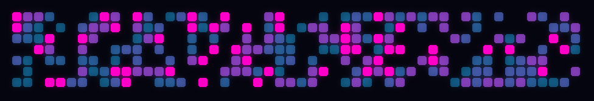

[](https://github.com/gustavo1braga/contribart/blob/master/README.pt-br.md)

# contribart

Transform your GitHub commit history into art: **neon**, **minimalist**, or **pixel art**, straight from your terminal.



# Now with color palettes!


**Ocean** palette with **neon** style. There's more variety than shown in this example.

## Why

GitHub's default contribution graph is plain and looks the same for everyone. `contribart` reuses the exact same data to generate an image you can showcase in your README, share on Twitter/LinkedIn, or use as a wallpaper.

## Installation

```bash
git clone https://github.com/gustavo1braga/contribart.git
cd contribart
pip install -r requirements.txt
```

Create a [Personal Access Token](https://github.com/settings/tokens) with the `read:user` scope and export it:

```bash
export GITHUB_TOKEN=ghp_xxxxxxxxxxxx
```

## Usage

```bash
python -m contribart --user octocat --style neon
python -m contribart --user octocat --style mono --out my_art.png
python -m contribart --user octocat --style pixel
python -m contribart --user octocat --style neon --palette sunset
```
| Option | Description | Default |
| --- | --- | --- |
| `--user` | GitHub username (required) | - |
| `--style` | Visual style: `neon`, `mono`, `pixel` | `neon` |
| `--palette` | Color palette (see below) | the style's default palette |
| `--out` | Output file path (`.png`) | `<user>_<style>.png` |

## Available Styles

| Style | Description | Default palette |
| --- | --- | --- |
| `neon` | Glow effect on a dark background | `neon` |
| `mono` | Minimalist flat cells | `github` |
| `pixel` | Downscale + upscale without smoothing (pixel art) | `pixel` |

## Color Palettes

Any palette can be combined with any style using `--palette`.

| Palette | Description |
| --- | --- |
| `neon` | Cyan to magenta on a near-black background |
| `github` | Classic GitHub green on a dark background |
| `pixel` | Dark green to mint on a dark background |
| `sunset` | Coral to warm yellow on a deep purple background |
| `ocean` | Deep blue to aqua on a navy background |
| `dracula` | Slate blue to pink on the Dracula gray background |

## Roadmap

* [x] More color palettes (`--palette`)
* [ ] "Poster" mode with username and statistics (`--poster`)
* [ ] Export as animated GIF (weeks appearing progressively) (`--gif`)
* [ ] Publish to PyPI (`pip install contribart`)

## License

MIT
